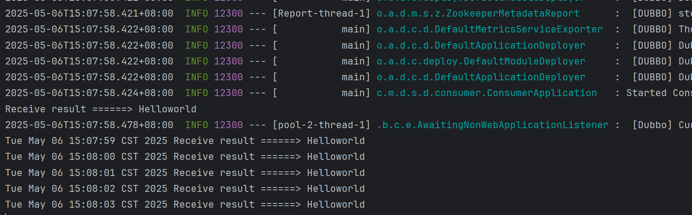

# Java21 + Spring Boot 3.4.5 + Dubbo 3.3.0 实践
## 2.3 动手实践1

### 部署zookeeper3.8.4 
修改zoo.cfg
```conf
# The number of milliseconds of each tick
tickTime=20000
# The number of ticks that the initial
# synchronization phase can take
initLimit=10
# The number of ticks that can pass between
# sending a request and getting an acknowledgement
syncLimit=5
# the directory where the snapshot is stored.
# do not use /tmp for storage, /tmp here is just
# example sakes.
dataDir=e:\\zkdata
# the port at which the clients will connect
clientPort=2181
# the maximum number of client connections.
# increase this if you need to handle more clients
#maxClientCnxns=60
#
# Be sure to read the maintenance section of the
# administrator guide before turning on autopurge.
#
# https://zookeeper.apache.org/doc/current/zookeeperAdmin.html#sc_maintenance
#
# The number of snapshots to retain in dataDir
#autopurge.snapRetainCount=3
# Purge task interval in hours
# Set to "0" to disable auto purge feature
#autopurge.purgeInterval=1

## Metrics Providers
#
# https://prometheus.io Metrics Exporter
#metricsProvider.className=org.apache.zookeeper.metrics.prometheus.PrometheusMetricsProvider
#metricsProvider.httpHost=0.0.0.0
#metricsProvider.httpPort=7000
#metricsProvider.exportJvmInfo=true
```

### 启动zookeeper
```shell
zkServer.cmd
```


datadir设置为了系统C盘,没有权限,修改为除了系统C盘的其他盘
```conf
dataDir=e:\\zkdata
```

### 重新启动zookeeper和consumer和provider


### Docker 启动 zookeeper
```shell
docker start zookeeper
```


### 参考
[SpringBoot官网](https://spring.io/projects/spring-boot)  
[Dubbo官网](https://cn.dubbo.apache.org/zh-cn/overview/home/)  
[Dubbo实践](https://www.cnblogs.com/crazymakercircle/p/18394238)  
